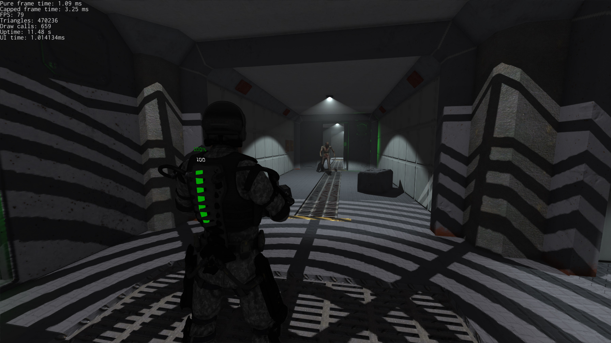
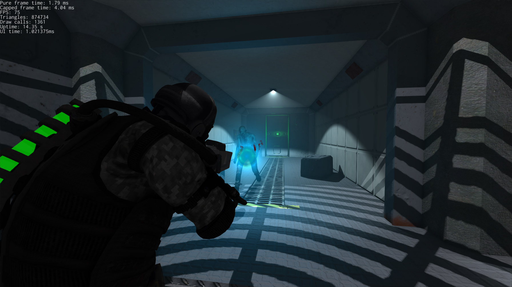
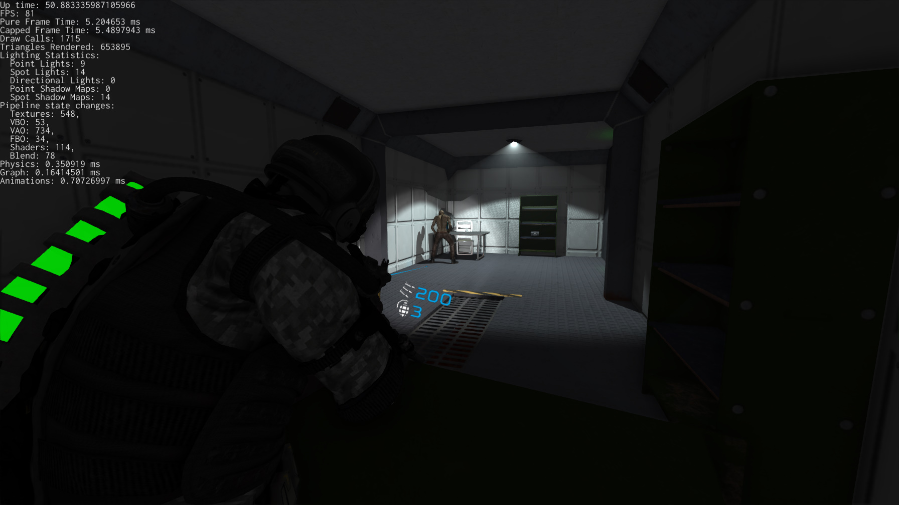
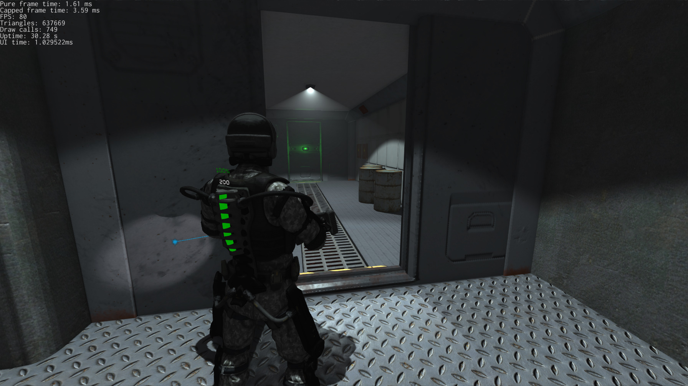
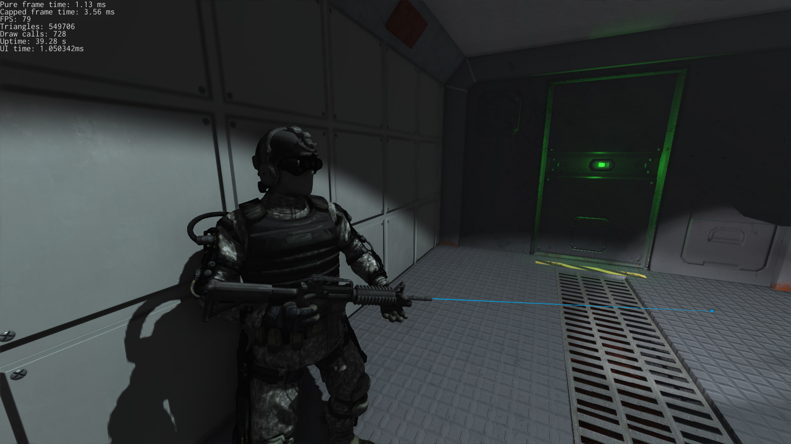

## Station Iapetus

- **Description**: 3rd person shooter in the very early development phase. This is commercial project that will eventually be
  released in Steam. Also, the project is meant to be the proof that [rg3d](https://github.com/mrDIMAS/rg3d)
  game engine is ready for commercial production.
- **Genre**: 3D Third-Person Shooter
- **Engine**: [rg3d](https://github.com/mrDIMAS/rg3d)
- **Tools**:
    - Level editor: [rusty-editor](https://github.com/mrDIMAS/rusty-editor)
    - 3D models: 3Ds Max 2010, [mixamo.com](mixamo.com) (character models)
    - Materials/textures: Substance Painter, [textures.com](textures.com)
    - Animations: [mixamo.com](mixamo.com)
- **Playable demo**: 29th of March
- **Release Date**: When it is done.
- **Store**: Steam
- **Platforms**: Windows (7+), Linux (Ubuntu?), macOS


## Plot

You're playing as a task force agent on a space prison near Saturn's satellite Iapetus. **The rest is yet 
to-be-decided.** The main source of inspiration is Dead Space series.

## Gameplay video

Check latest gameplay video on my YouTube channel:

[](https://www.youtube.com/watch?v=jHEEUJxrzj8)

_Keep in mind that it can be different from the latest version!_

## Screenshots







## How to build

Install Rust toolchain first (https://rustup.rs/), then:

In case of clean build:
```shell
git clone https://github.com/mrDIMAS/rg3d
git clone https://github.com/mrDIMAS/StationIapetus
cd StationIapetus
cargo run --release
```

In case if you're updating to the latest version:
```shell
cd rg3d
git pull
cd ../StationIapetus
git pull
cargo run --release
```
 
## Contributing

By making a contribution you're giving your agreement to use your contribution commercially and royalty-free.
However, you can contact me if you want to participate in the development for % of profit (don't expect it 
to be large).

## License

The project uses GNU GPL 3.0. The data (3d models, textures, sound, etc.) is proprietary and **cannot** be used 
without my permission.  